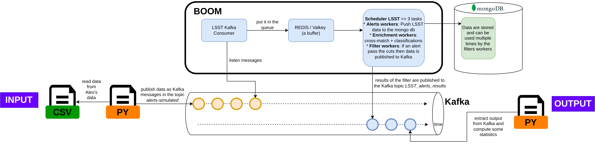

# LSST Simulated Alert Pipeline — Running on the VM

## Architecture



The input CSV files are read by the Python producer, which converts each observation row into
an LSST Avro alert and publishes it to the Kafka topic `alerts-simulated`. BOOM consumes those
alerts through three worker stages — ingestion, enrichment (cross-match + classifications), and
filtering — storing results in MongoDB. Alerts that pass the filter are published to the Kafka
topic `LSST_alerts_results` and extracted into CSV files for analysis.

---

## Prerequisites — Python environment

Python >= 3.13 and [uv](https://docs.astral.sh/uv/) are required.

### Create the virtual environment

```bash
uv venv                  # creates .venv/ in the repo root
```

### Install dependencies

```bash
uv pip install lsst-alert-packet confluent-kafka numpy pandas fastavro
```

### Activate (optional)

`uv run` resolves the venv automatically, so activation is only needed if you want
to call scripts directly with `python`:

```bash
source .venv/bin/activate      # Linux / macOS
```

> `run.py`, `plot_lightcurves.py`, and `extract_output.py` declare their own dependencies
> via inline metadata and are always invoked with `uv run` — no manual install needed for them.
> Only `produce-lsst-simulated.py` (called via `.venv/bin/python`) requires the venv above.

---

## 1. Connect to the VM

```bash
ssh [login]@157.136.254.119
```

Recommended: add an alias to `~/.bashaliases`:

```bash
alias sshboomvm='ssh [login]@157.136.254.119'
source ~/.bashrc
```

Once connected:

```bash
sudo su
cd /home/almalinux
```

---

## 2. Transfer the dataset to the VM

The Boom repository lives at `/home/almalinux/boom/`. Copy your dataset with:

```bash
rsync -avz --rsync-path="sudo rsync" /path/to/local/dataset/ [login]@157.136.254.119:/home/almalinux/boom/
```

The dataset directory must follow the layout described in `README_input.md`
(`lightcurve_*.csv` + `summary.csv`).

---

## 3. Build the Docker image

Run once, or after any code change:

```bash
BOOM_REPO_ROOT=$(pwd) docker compose -f tests/lsst-simulated/compose.yaml build --no-cache
```

---

## 4. Run the simulation

```bash
BOOM_REPO_ROOT=$(pwd) uv run tests/lsst-simulated/run.py \
    --boom-repo-dir . \
    --data-dir /path/to/dataset \
    --timeout 600 \
    --limit 1000
```

`run.py` will:
1. Generate `tests/lsst-simulated/config.yaml` from the root `config.yaml` (patching DB name, broker address, and credentials for the isolated stack)
2. Count expected alerts from `summary.csv` (or by reading the CSV files directly if `n_detected` is unavailable)
3. Start all services via `tests/lsst-simulated/compose.yaml`
4. Poll MongoDB until all expected alerts are ingested and enriched
5. Tear everything down (unless `--keep-up` is set)

### Options

| Flag | Default | Description |
|---|---|---|
| `--boom-repo-dir` | `.` | Path to the repo root |
| `--data-dir` | `data_alex/` | Directory containing the dataset |
| `--timeout` | `600` | Seconds before the test fails |
| `--limit N` | `0` (no limit) | Process at most N lightcurve files |
| `--keep-up` | off | Keep services running after the test (required to extract results — see step 5) |
| `--filter-file` | `tests/lsst-simulated/filter_KN_PRODUCTION.json` | Filter JSON pipeline to load |

### Using a different filter

```bash
BOOM_REPO_ROOT=$(pwd) uv run tests/lsst-simulated/run.py \
    --boom-repo-dir . \
    --filter-file /path/to/my_filter.json
```

### Stop the simulation manually

```bash
BOOM_REPO_ROOT=$(pwd) docker compose -f tests/lsst-simulated/compose.yaml down -v
```

---

## 5. Extract results (requires `--keep-up`)

When the simulation finishes with `--keep-up`, the Kafka broker is still running and you can
extract filter results into CSV files:

```bash
uv run tests/lsst-simulated/extract_output.py \
    --broker localhost:9092 \
    --data-dir /path/to/dataset \
    --photometry-out photometry.csv \
    --stats-out stats.csv
```

This reads the `LSST_alerts_results` Kafka topic and writes:

| File | Description |
|---|---|
| `photometry.csv` | One row per detection for every object that passed the filter. `passed_filter=True` marks the detection that triggered the pass. Columns: `object_id`, `candid`, `jd`, `mjd`, `band`, `flux_njy`, `flux_err_njy`, `mag`, `mag_err`, `passed_filter` |
| `stats.csv` | One row per passing object with aggregate statistics and filter efficiency. Columns: `object_id`, `target_name`, `ra`, `dec`, `n_detections`, `n_passed_filter`, `filter_names`, `first_jd`, `last_jd` |

`--data-dir` is optional but recommended: it adds the `target_name` field from `summary.csv`
to `stats.csv`.

> Requires `confluent-kafka`, `fastavro`, `lsst-alert-packet` and the broker port exposed
> (`ports: - "9092:9092"` in `compose.yaml` broker service).

After extraction, tear down the stack:

```bash
BOOM_REPO_ROOT=$(pwd) docker compose -f tests/lsst-simulated/compose.yaml down -v
```

---

## 6. Analyse results

Plot lightcurves:

```bash
uv run tests/lsst-simulated/plot_lightcurves.py \
    --photometry photometry.csv \
    --output-dir plots/
```

Check filter pass rate in scheduler logs:

```bash
grep -E "passed|sent total" logs/lsst-simulated/scheduler.log
```

`Successfully sent total of X/Y` — X alerts sent to Kafka, Y passed the filter pipeline.

---

## Logs

While running, per-service logs are streamed to:

```
logs/lsst-simulated/producer.log
logs/lsst-simulated/consumer.log
logs/lsst-simulated/scheduler.log
```

---

## Future steps

- Input files can also handle parquet files
- Multi simulations in parallel
